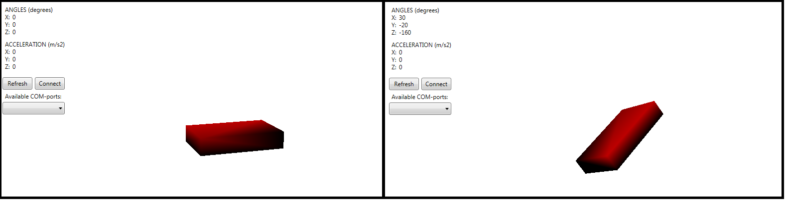

# About 

`Stm32Project` является проектом, позволяющим определять положение объекта в *трёхмерном пространстве* с передачей данных на компьютер. 

Данное приложение позволяет вращать *трёхмерную модель* на экране, вращая *реальный объект*, на котором прикреплён *акселерометр*. 

Приложение поделено на два уровня: 
- **нижний**: измерение *относительных ускорений* объекта с помощью акселерометра **ADXL345** (написано на языке `С++` для микроконтроллера **STM32F411RE**); 
- **верхний**: визуальное представление полученных данных (написано на языке `C#` с использованием графической подсистемы **WPF**). 

Данные с *акселерометра* на *микрокотроллер* передаются через интерфейс **I2C**, а с *микроконтроллер* на *компьютер* - с помощью интерфейса **UART**. 

Описание настройки регистров для передачи данных представлено по [ссылке](DataTransmission.md). 
