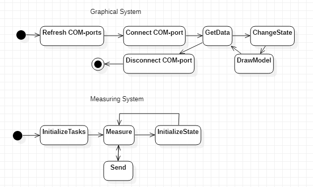
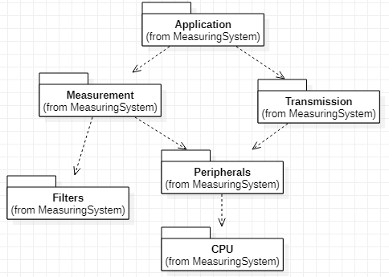
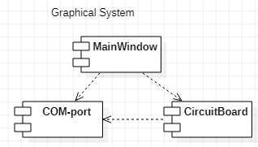
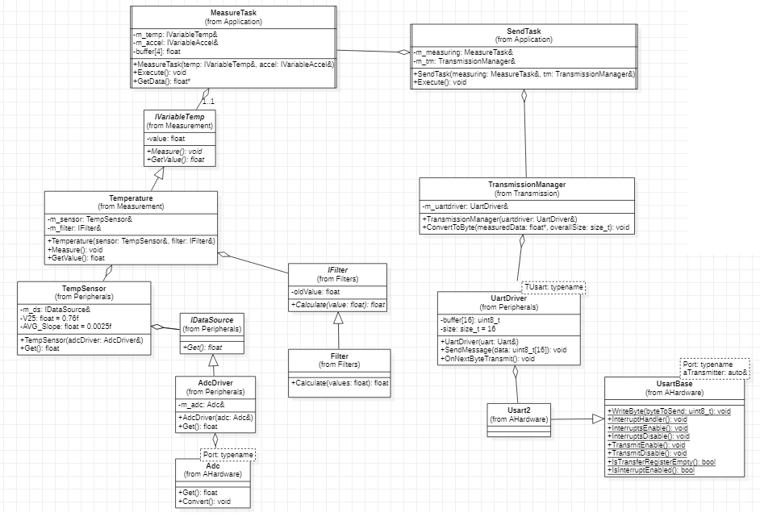

# Design

General description of the application is presented [here](../README.md). 

## Architecture

**Statechart diagram** of the system (including *graphical* and *measuring* subsystems) is shown on the figure below: 

**Packet diagram** of a *measuring part* of the system might look like: 

**Packet diagram** of a *graphical part* of the system might look like: 

**Class diagram** of a *graphical part* of the system is shown on the figure below: 

