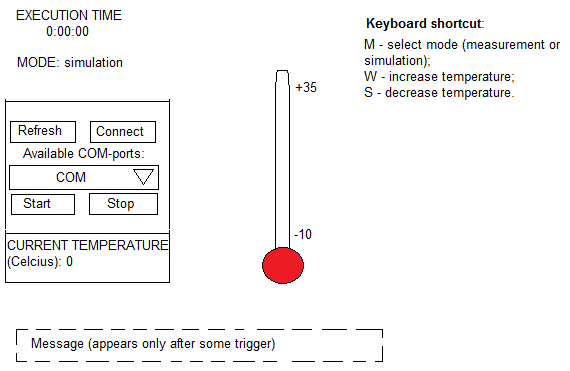
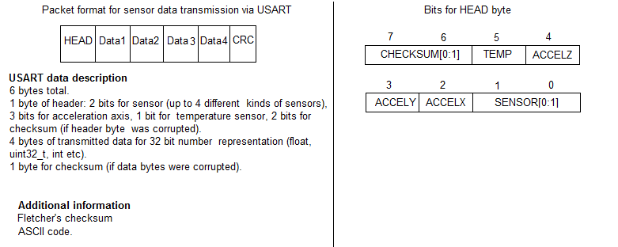

# Design 

Техническое задание представлено [здесь](https://github.com/lamer0k/Lections/blob/master/%D0%9A%D1%83%D1%80%D1%81%D0%BE%D0%B2%D0%BE%D0%B9%20%D0%B2%D0%B0%D1%80%D0%B8%D0%B0%D0%BD%D1%82%205.pdf).  

[Здесь](About.md) представлено общее описание приложения. 

## Проектирование графического интерфейса

Примерное графическое представление системы изображено на рисунке снизу: 

## Обзор системы

Система состоит из следующих компонентов:
- Акселерометр **ADXL345** (для измерения векторов ускорения по каждой из осей); 
- Встроенный датчик температуры (для измерения окружающей температуры); 
- **I2C** (для передачи данных с акселерометра на микроконтроллер); 
- **USART** (для передачи данных с микроконтроллера на компьютер); 
- Программа в виде *графического интерфейса* (для визуального отображения углов поворота объекта в пространстве, ускорений и температуры).  

На рисунке ниже представлена **схема соединения** составных компонентов системы на аппаратном уровне: 

Для корректной работы программы критически важно **устанавливать задержку** на передачу данных с микроконтроллера на компьютер, чтобы программа верхнего уровня не зависала. 
Потому что когда идёт постоянный поток данных, в лучшем случае программа верхнего уровня на **WPF** перестаёт реагировать на какие-либо воздействия, но чаще всего программа вылетает с исключением **APPCRASH**. 

**Настройка конфигурации портов** (контроль чётности, количество стоп бит, количество бит данных, скорость передачи) **производится в самом коде** специально под технические требования. 
[Здесь](DataTransmission.md) можно ознакомиться с тем, каким образом производится настройка конфигурации портов для передачи данных с помощью **USART**. 

Один раз в *100 мс* микроконтроллер отсылает данные, измеренные с помощью *гироскопа* и *акселерометра*, на компьютер.

Для того, чтобы было удобнее распаковать на компьютере данные, полученные с микроконтроллера, был придуман **формат пакета**, который будет использоваться конкретно под данную систему: 

На рисунке представлено общее описание пакета. 
Более подробное описание представлено [здесь](UartPacket.md). 

*CRC* позволяет оценить целостность данных при отправке (в данном приложении используется [контрольная сумма Флетчера](https://en.wikipedia.org/wiki/Fletcher%27s_checksum) ввиду прстоты реализации). 

Если данные всё-таки были искажены при отправке (т.е. когда *CRC* не будет совпадать), то эти искажённые данные просто будут игнорироваться.  
Таким образом, в данном приложении реализуется аналог *UDP-протокола*. 

Как известно, пакет UART выглядит, как показано ниже: 

По заданию необходимо реализовать передачу данных на скорости 19200 кБит/сек (будем использовать 8 бит для передаваемых данных). 

То есть для того, чтобы передать один пакет для данных типа float (одно измеренное значение), необходимо будет 8 пакетов UART. 
Всего передаётся 4 измеренных значения, поэтому для передачи всех измеренных значений нужно будет отправить 32 пакета UART. 

Передача данных происходит один раз в 100 мс, поэтому для избежания наложения данных друг на друга надо, чтобы за 100 мс успело быть передано 1920 бит данных. 
Умножив количество передаваемых пакетов на их длину, получаем значение, которое будет меньше, чем 1920 бит (значение было рассчитано с запасом: до 16 бит для одного пакета UART, то есть все измеренные значения будут закодированы менее, чем в 512 бит). 

То есть при скорости передачи данных 19200 кБит/сек сообщение можно спокойно передать, используя формат пакета на рисунке выше. 

## Проектирование архитектуры

**Диаграмма состояний** всей системы (включая *графическую* и *измерительную* подсистему) представлена на рисунке ниже: 

<!--Перепроверить диаграммы компонентов, преобразовать их в диаграммы пакетов (библиотек)-->
**Диаграмма компонентов** для *измерительной части* системы может выглядеть следующим образом: 

**Диаграмма компонентов** для *графической части* системы может выглядеть следующим образом: 

Диаграмма классов графической подсистемы приложения представлена на рисунке ниже: 

Полное описание классов представлено по [ссылке](ClassDescriptions.md). 

В *графической подсистеме*, наверное, нужно будет реализовывать шаблон **Singleton** (для того, чтобы предотвратить двойное создание таких объектов как *плата* и *COM-порт*) и **Наблюдатель** (для отслеживания наличия изменений *вектора состояния* платы). 
Ещё должна быть осуществлена распаковка *посылки* из пакетов измеренных значений.  

В *измерительной подсистеме* используется операционная система **FreeRTOS** как каркас для всего приложения, и всё приложение, по сути, будет зависеть от архитектуры **FreeRTOS**. 

<!--
Насколько я понял, на плате есть пины и названия пинов на самой плате соответствуют пинам, с которыми идёт взаимодействие в программе. 

Микроконтроллер - это master receiver, а гироскоп и акселерометр - это slave transmitter. 

На рисунке ниже представлена принципиальная схема устройства: 
-->
