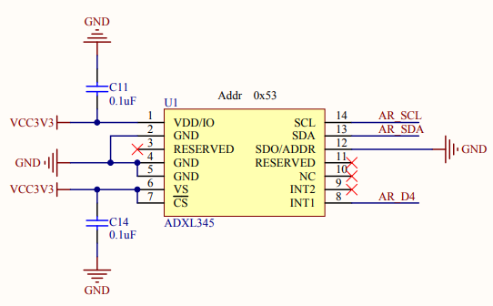

# Теория по I2C 

## Общий теоретический материал 

В *теории информации* и *computer science* система имеет состояния, если она способна запоминать предшествующие события. 
Тогда вся запомненная информация называется **состоянием** системы. 

В дискретных системах пространство состояний *исчисляемо* и *конечно*. 

**Синхронной схемой** называется цифровая схема, в которой изменение состояний элементов в памяти синхронизируется с помощью *сигнала тактирования*. 

*Сигнал тактирования* колеблется между высоким и низким уровнем и меняет своё состояние на противоположное через равные промежутки времени (причём промежуток времени между сменой состояний можно задавать программно). 
Используется он для координации действий цифровых схем. 


Сигнал тактирования вырабатывается *тактовым генератором*.
Большинство интегральных схем используют *тактовый сигнал* для синхронизации различных частей схемы. 
При этом циклическая смена состояний (с высокого на низкий уровень и наоборот) производится со скоростью, меньшей, чем внутренние задержки микросхемы в наихудшем случае.

## Общая информация про I2C 

**I2C** (**Inter-Integrated Circuit**) - это синхронная шина последовательной передачи данных, реализующая пакетную передачу данных, поддерживающая несколько master-устройств и несколько slave-устройств. 

*I2C* широко используется для присоединения к процессору *периферийных устройств*, работающих на более низких частотах. 

Особым достоинством I2C является способность микроконтроллера управлять целой сетью из устройств с помощью всего двух выводов **GPIO**. 


Многие другие технологии, использующие общую шину для передачи данных между устройствами (например, *SPI*), для подключения нескольких устройств требуют значительно большего количества контактов.

I2C использует только две двунаправленные линии с *открытым коллектором* или *открытым стоком* (в том, чем отличаются *Open drain* и *Open collector*, и в чём их суть, я не успел разобраться), а также последовательную линию передачи данных (SDA) и последовательную линию синхронизации (SCL), подтянутых резисторами к питанию (собственно, это изображено на рисунке сверху). 
Обычно используются напряжения +5 В или +3,3 В, хотя разрешены системы с другими напряжениями. 

*I2C* имеет 7-битное адресное пространство с редко используемым 10-битным расширением. 
Обычными скоростями шины *I2C* являются стандартный режим 100 кбит/с и высокоскоростной режим 400 кбит/с. 

Служебные данные протокола включают адрес подчиненного устройства и, возможно, адрес регистра в подчиненном устройстве, а также побайтовые биты ACK/NACK. 

Таким образом, фактическая скорость передачи пользовательских данных ниже, чем предполагают только эти пиковые скорости передачи данных. Например, если каждое взаимодействие с ведомым устройством неэффективно позволяет передавать только 1 байт данных, скорость передачи данных будет меньше половины максимальной скорости передачи битов.

Количество узлов, которые могут существовать на данной шине I2C, ограничено адресным пространством. 

Протокол I2C позволяет с помощью двух проводов соединить большое количество устройств из-за того, что у каждого отдельного устройства есть свой ID. 

Шина имеет две роли для узлов, т.е. Master и Slave:
Master узел - узел, который генерирует тактовую частоту и инициирует связь с ведомыми устройствами.
Slave узел - узел, принимающий тактовую частоту и отвечающий на обращение ведущего.

Шина I2C является шиной с несколькими ведущими, что означает, что может присутствовать любое количество Master-узлов. 
Кроме того, Master и Slave могут меняться между собой ролями в периодах между отправкой сообщений (обычно после отправки *STOP*).

Для каждого устройства шины может быть четыре возможных режима работы в зависимости от того, кто кому шлёт сообщения, и кто является ведущим/ведомым:
- *master transmit* - ведущий узел отправляет данные ведомому,
- *master receive* - мастер-узел получает данные от ведомого,
- *slave transmit* - подчиненный узел отправляет данные мастеру,
- *slave receive* - подчиненный узел получает данные от мастера.

## Алгоритм работы с I2C

Для работы с любой периферией, сначала нужно подать тактирование на порт, который будет использоваться (для подключения платы Accessory Shield используется PB8 и PB9), после этого настроим выводы для работы с I2C:  
```C++
// Switch on external 16 MHz oscillator
RCC::CR::HSION::On::Set() ;
while (!RCC::CR::HSIRDY::Ready::IsSet());

// Switch system clock on external oscillator
RCC::CFGR::SW::Hsi::Set() ;
while (!RCC::CFGR::SWS::Hsi::IsSet());
    
// Switch on clock on Port B. 
RCC::AHB1ENR::GPIOBEN::Enable::Set();

// Enable PB8 and PB9 for I2C1 as alternate. 
GPIOB::MODERPack<
    GPIOB::MODER::MODER8::Alternate, 
    GPIOB::MODER::MODER9::Alternate  
    >::Set();

// Set the alternate functions for pins 8 and 9. 
GPIOB::AFRH::AFRH8::Af4::Set(); 
GPIOB::AFRH::AFRH9::Af4::Set(); 

// Type register open drain. 
GPIOB::OTYPER::OT8::OutputOpenDrain::Set(); 
GPIOB::OTYPER::OT9::OutputOpenDrain::Set(); 

// Output speed register low. 
GPIOB::OSPEEDR::OSPEEDR8::LowSpeed::Set(); 
GPIOB::OSPEEDR::OSPEEDR9::LowSpeed::Set(); 

// No internal pull up, pull down resistors. 
GPIOB::PUPDR::PUPDR8::NoPullUpNoPullDown::Set(); 
GPIOB::PUPDR::PUPDR9::NoPullUpNoPullDown::Set(); 
```

**Комментарий к коду**: тактирование будет идти от *внешнего генератора* 16 МГц, затем к источнику тактирования подключается порт В, далее `PB8` и `PB9` для `I2C1` включаются как *alternate*, выбирается тип регистра с *открытым стоком* (англ. *open drain*), низкая выходная скорость регистра для портов `PB8` и `PB9` и отсутствие резистров на выводах SDA и SCL акселерометра **ADXL345**, подтягивающих к питанию или к земле (ниже представлена схема для акселерометра **ADXL345**). 



Последовательность заполнения данных для I2C представлена на рисунке ниже: 


Изначально Master находится в режиме *master transmit*, отправляет START и затем 7-битный адрес slave-устройства, с которым он хочет связаться. 
Затем, наконец, следует один бит, указывающий, хочет ли Master записать данные в регистр данных slave-устройства (тогда ставит 0) или прочитать данные от slave-устройства (тогда ставит 1). 
```C++
#define DEVICE_ID   0x53 

// Peripheral clock enable register. 
RCC::APB1ENR::I2C1EN::Enable::Set();

// I2C1 clocking (2 MHz).
I2C1::CR2::FREQ::Set(0b000010); 

// Enable peripheral. 
I2C1::CR1::PE::Enable::Set(); 

// Reset I2C. 
while ( I21::SR2::BUSY::Value1::IsSet() );  // While the bus is busy, just wait. 
I21::CR1::SWRST::UnderReset::Set();         // When the bus is not busy, reset I2C. 

// Assert that master wants to write register address for ADXL345. 
I2C1::CR1::START::Enable::Set();            // Send start bit. 
I2C1::OAR1::ADD7::Set(DEVICE_ID);           // Set address of device ADXL345. 
I2C1::OAR1::ADD0::Value0::Set();            // Master writes.
```

Если slave-устройство существует на шине, оно ответит битом ACK (активный низкий уровень для подтверждения) для этого адреса. 
Затем запишем адрес регистра акселеерометра **ADXL345**, к которому нужно обращаться, снова получим ACK и пошлём стоповый бит. 
```C++
// Get ACK if ADXL345 exists (ACK = 0). 
if ( I2C1::CR1::ACK::NoAcknowledge::IsSet() )
{
    // Write register address of ADXL345 (for example, DATAX0).
    I2C1::DR::Write(0x32);

    // Get if ADXL345 got address. 
    if ( I2C1::CR1::ACK::NoAcknowledge::IsSet() )
    {
        I2C1::CR1::STOP::Enable::Set();            // Send stop bit. 
    }
}
```

Затем ведущее и ведомое устройство продолжают работу в режиме передачи или приема (в зависимости от отправленного им бита чтения/записи).
Например, для чтения данных из регистра `DATAX0` и `DATAX1` акселерометра **ADXL345**, пошлём стартовый бит, адрес устройства, установим бит для чтения (т.е. 1) и начнём чтение, в конце поставим ACK, равный единице, и стоповый бит.
```C++
// Assert that master wants to read register address for ADXL345. 
I2C1::CR1::START::Enable::Set();            // Send start bit. 
I2C1::OAR1::ADD7::Set(DEVICE_ID);           // Set address of device ADXL345. 
I2C1::OAR1::ADD0::Value1::Set();            // Master reads.

union 
{
    uint16_t accelx_uint16; 
    char accelx_char[2]; 
} accelx;

int lenght = 2; 

// Get ACK if ADXL345 exists (ACK = 0). 
if ( I2C1::CR1::ACK::NoAcknowledge::IsSet() )
{
    // Read data from DATAX0 and DATAX1 of ADXL345. 
    for (i = 0; i < lenght; i++)
    {
        accelx.accelx_char[i] = I2C1::DR::Get(); 

        if (i != lenght)
        {
            I2C1::CR1::ACK::NoAcknowledge::Set();   // Mater sets ACK = 0 for any byte (except the last one). 
        }
        else 
        {
            I2C1::CR1::ACK::Acknowledge::Set();     // Mater sets ACK = 1 for the last byte. 
        }
    }
    
    // Master sends stop bit. 
    I2C1::CR1::STOP::Enable::Set();
}
```

Байты адреса и данных передаются первым старшим битом (MSB). 
Если ведущее устройство желает записать данные в ведомое устройство, оно повторно отправляет байт, при этом ведомое устройство отправляет бит ACK. 

Если ведущий желает читать с ведомого, то он многократно получает байт от ведомого, причем ведущий отправляет бит ACK после каждого байта, кроме последнего. 

Транзакция I2C может состоять из нескольких сообщений. 
Мастер завершает сообщение условием STOP, если это конец транзакции, или он может отправить другое условие START, чтобы сохранить контроль над шиной для другого сообщения (транзакция «комбинированного формата»).

Перед началом взаимодействия с I2C советуют сбрасывать I2C с помощью `I2C1::CR1::SWRST::UnderReset::Set()`, причём сначала проверить, не занята ли шина с помощью `I2C1::SR2::BUSY::Value1::IsSet()`.
Но при отладке выяснилось, что шина изначально занята, поэтому если мы хотим, чтобы I2C не сбрасывалась, пока не выяснится, что шина свободна, то мы застрянем в бесконечном цикле проверки.  
Исходя из этого, соответствующий код был закомментирован.  

Полный код работы с I2C представлен ниже: 
```C++
/******************************************
* ADXL345 functionality. 
******************************************/ 

#include "ADXL345.h"

/******************************************
* CPU registers. 
******************************************/ 

#include "gpiobregisters.hpp"           // for GPIOB (PB8 and PB9).
#include "rccregisters.hpp"             // for RCC.
//#include "nvicregisters.hpp"            // for NVIC.
#include "i2c1registers.hpp"            // for I2C1.

/******************************************
* Common C++ includes. 
******************************************/ 

#include <cstdint>                      // for int types such as uint32_t.
#include <iostream>                     // for std::cout. 

/******************************************
* Global variables. 
******************************************/ 

union 
{
    uint16_t accelx_uint16; 
    char accelx_char[2]; 
} accelx;

union 
{
    uint16_t accely_uint16; 
    char accely_char[2]; 
} accely;

union 
{
    uint16_t accelz_uint16; 
    char accelz_char[2]; 
} accelz;

int lenght = 2; 

/******************************************
* Low level initialization. 
******************************************/ 

extern "C"
{
  int __low_level_init(void)
  {
    /******************************************
    * Clocking configuration. 
    ******************************************/ 
    
    // Switch on external 16 MHz oscillator
    RCC::CR::HSION::On::Set() ;
    while (!RCC::CR::HSIRDY::Ready::IsSet());

    // Switch system clock on external oscillator
    RCC::CFGR::SW::Hsi::Set() ;
    while (!RCC::CFGR::SWS::Hsi::IsSet());
        
    // Switch on clock on Port B. 
    RCC::AHB1ENR::GPIOBEN::Enable::Set();
    
    /******************************************
    * PB8 and PB9 configuration. 
    ******************************************/ 

    // Enable PB8 and PB9 for I2C1 as alternate. 
    GPIOB::MODERPack<
        GPIOB::MODER::MODER8::Alternate, 
        GPIOB::MODER::MODER9::Alternate  
        >::Set();

    // Set the alternate functions for pins 8 and 9. 
    GPIOB::AFRH::AFRH8::Af4::Set(); 
    GPIOB::AFRH::AFRH9::Af4::Set(); 

    // Type register open drain. 
    GPIOB::OTYPER::OT8::OutputOpenDrain::Set(); 
    GPIOB::OTYPER::OT9::OutputOpenDrain::Set(); 

    // Output speed register low. 
    GPIOB::OSPEEDR::OSPEEDR8::LowSpeed::Set(); 
    GPIOB::OSPEEDR::OSPEEDR9::LowSpeed::Set(); 

    // No internal pull up, pull down resistors. 
    GPIOB::PUPDR::PUPDR8::NoPullUpNoPullDown::Set(); 
    GPIOB::PUPDR::PUPDR9::NoPullUpNoPullDown::Set(); 
    
    /******************************************
    * I2C1 configuration. 
    ******************************************/ 
    
    // Peripheral clock enable register. 
    RCC::APB1ENR::I2C1EN::Enable::Set();
    
    // I2C1 clocking (2 MHz).
    I2C1::CR2::FREQ::Set(0b000010); 
    
    // Enable peripheral. 
    I2C1::CR1::PE::Enable::Set(); 
    
    // Slave address. 
    //I2C1::OAR1::ADD7::Set(DeviceID); 
    
    return 1;
  }
}

void write(char device, char reg)
{
    // Assert that master wants to write register address for ADXL345. 
    I2C1::CR1::START::Enable::Set();            // Send start bit. 
    I2C1::OAR1::ADD7::Set(device);           // Set address of device ADXL345. 
    I2C1::OAR1::ADD0::Value0::Set();            // Master writes.
    
    // Get ACK if ADXL345 exists (ACK = 0). 
    if ( I2C1::CR1::ACK::NoAcknowledge::IsSet() )
    {
        // Write register address of ADXL345 (for example, DATAX0).
        I2C1::DR::Write(reg);

        // Get if ADXL345 got address. 
        if ( I2C1::CR1::ACK::NoAcknowledge::IsSet() )
        {
            I2C1::CR1::START::Disable::Set();          // Disable start bit. 
            I2C1::CR1::STOP::Enable::Set();            // Send stop bit. 
        }
    }
}

void read(char device, char *var)
{
    // Assert that master wants to read register address for ADXL345. 
    I2C1::CR1::STOP::Disable::Set();            // Disable stop bit.
    I2C1::CR1::START::Enable::Set();            // Send start bit. 
    I2C1::OAR1::ADD7::Set(device);     // Set address of device ADXL345. 
    I2C1::OAR1::ADD0::Value1::Set();            // Master reads.
    
    // Get ACK if ADXL345 exists (ACK = 0). 
    if ( I2C1::CR1::ACK::NoAcknowledge::IsSet() )
    {
        // Read data from DATAX0 and DATAX1 of ADXL345. 
        for (int i = 0; i < lenght; i++)
        {
            var[i] = I2C1::DR::Get(); 

            if (i != lenght)
            {
                I2C1::CR1::ACK::NoAcknowledge::Set();   // Mater sets ACK = 0 for any byte (except the last one). 
            }
            else 
            {
                I2C1::CR1::ACK::Acknowledge::Set();     // Mater sets ACK = 1 for the last byte. 
            }
        }
        
        // Master sends stop bit. 
        I2C1::CR1::STOP::Enable::Set();
    }
    I2C1::CR1::STOP::Disable::Set();            // Disable stop bit.
}

/******************************************
* Main code. 
******************************************/ 

int main()
{
    // Reset I2C. 
    //while ( I2C1::SR2::BUSY::Value1::IsSet() );  // While the bus is busy, just wait. 
    //I2C1::CR1::SWRST::UnderReset::Set();         // When the bus is not busy, reset I2C. 
    
    while(1)
    {
        write(ADXL345_ADDRESS, ADXL345_DATAX0); 
        read(ADXL345_ADDRESS, &(accelx.accelx_char[0])); 
        
        write(ADXL345_ADDRESS, ADXL345_DATAY0); 
        read(ADXL345_ADDRESS, &(accely.accely_char[0])); 
        
        write(ADXL345_ADDRESS, ADXL345_DATAZ0); 
        read(ADXL345_ADDRESS, &(accelz.accelz_char[0])); 
        
        // Print out accelerations along all axis. 
        std::cout << "X: " << accelx.accelx_uint16 << " "; 
        std::cout << "Y: " << accely.accely_uint16 << " "; 
        std::cout << "Z: " << accelz.accelz_uint16 << std::endl; 
    }
  
    return 0 ;
}
```

## Список использованной литературы 

1. https://en.wikipedia.org/wiki/State_(computer_science)
1. https://en.wikipedia.org/wiki/Synchronous_circuit
1. https://hubstub.ru/stm32/152-push-pull-vs-open-drain.html
1. https://en.wikipedia.org/wiki/I%C2%B2C
